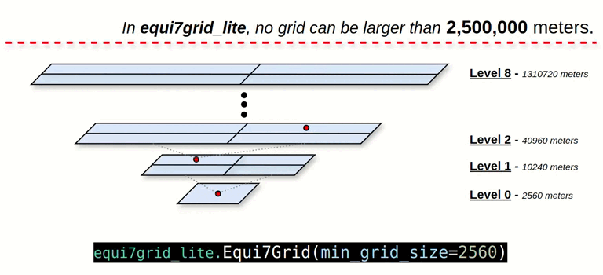

# 

<p align="center">
  
</p>

<p align="center">
    <em>
    No one will drive us from the paradise which Equi7Grid created for us
    </em>
</p>

<p align="center">
<a href='https://pypi.python.org/pypi/equi7grid-lite'>

</a>
<a href='https://colab.research.google.com/drive/1SBjl4GVgCFUpVch2Prju5oiXN8WyzZTi?usp=sharing'>

</a>
<a href="https://opensource.org/licenses/MIT" target="_blank">

</a>
<a href="https://github.com/psf/black" target="_blank">

</a>
<a href="https://pycqa.github.io/isort/" target="_blank">

</a>
</p>

---

**GitHub**: [https://github.com/csaybar/equi7grid-lite](https://github.com/csaybar/equi7grid-lite) 🌐

**PyPI**: [https://pypi.org/project/equi7grid-lite/](https://pypi.org/project/equi7grid-lite/) 🛠️

---

## **Overview** 📊

The **equi7grid-lite** package implements a user-friendly Python interface to interact with the [**Equi7Grid**](https://github.com/TUW-GEO/Equi7Grid) grid system. With this package, users can convert geographic coordinates to Equi7Grid tiles and vice versa.

**equi7grid-lite** is an **unofficial Python implementation of Equi7Grid**. It offers improvements and a simplified interface for grid interaction. This implementation differs from the official version in three key ways:

- **Quad-Tree Grid Splitting**: Users split the grid in a Quad-Tree fashion, with each grid level divided into four tiles.
- **Revised Grid ID Encoding**: The grid ID is encoded in meters, without the "T1", "T3", or "T6" tile system references.
- **Upper Bound Level**: The grid level is capped at a threshold of 2,500,000 meters to manage grid complexity.

## **Key Features** ✨
- **Coordinate Conversion**: Convert between geographic coordinates and Equi7Grid tiles easily. 🌍
- **Quad-Tree Grid Management**: Supports splitting and managing grids in a Quad-Tree structure. 🗺️
- **Cubo Integration**: Use equi7grid-lite in combination with Cubo for Earth Observation (EO) data retrieval. 🛰️

<p align="center">
  
</p>

Please refer to the [Equi7Grid repository](https://github.com/TUW-GEO/Equi7Grid) for more information on the official implementation.

## **Installation** ⚙️

Install the latest version from PyPI:

```bash
pip install equi7grid-lite
```


## **How to use** 🛠️

### **Basic Usage: Working with the Equi7Grid** 🗺️

#### **Convert geographic coordinates to Equi7Grid tiles**

```python
from equi7grid_lite import Equi7Grid

grid_system = Equi7Grid(min_grid_size=2560)
lon, lat = -79.5, -5.49
grid_system.lonlat2grid(lon=lon, lat=lat)
# Equi7Grid(min_grid_size=2560)
# ----------------
# levels: 0, 1, ... , 7, 8
# zones: AN, NA, OC, SA, AF, EU, AS
# min_grid_size: 2560 meters
# max_grid_size: 1310720 meters
```

#### **Convert from grid ID to geographic coordinates**

```python
grid_system.grid2lonlat(grid_id="SA2560_E2009N2525")
#                  id        lon       lat          x          y zone level  land             geometry
#0  SA2560_E2009N2525 -79.507568 -5.485739  5144320.0  6465280.0   SA    Z0  True  POLYGON ((514560...
```

### **Grid Management: Creating Grids for a Specific Region**

You can create a grid for a given bounding box or polygon.

```python
import geopandas as gpd
from equi7grid_lite import Equi7Grid

# Load country geometry (e.g., Peru)
world_filepath = gpd.datasets.get_path('naturalearth_lowres')
world = gpd.read_file(world_filepath)
country = world[world.name == "Peru"].geometry

# Create a grid of Equi7Grid tiles that cover the bounding box of the country
grid = grid_system.create_grid(
    level=4,
    zone="SA",
    mask=country # Only include tiles that intersect the polygon
)

# Export the grid to a GeoDataFrame
grid.to_file("grid.shp")
```

### **Cubo Integration** 🛰️

Use the `equi7grid-lite` package with [cubo](https://github.com/ESDS-Leipzig/cubo)  to retrieve EO data.


```python
import cubo
import rioxarray
from equi7grid_lite import Equi7Grid
from rasterio.enums import Resampling

# Initialize Equi7Grid system
grid_system = Equi7Grid(min_grid_size=2560)

# Use CUBO to retrieve EO data
lon, lat = -122.4194, 37.7749
cubo_params = grid_system.cubo_utm_parameters(lon=lon, lat=lat)
da = cubo.create(
    lat=cubo_params["lat"],
    lon=cubo_params["lon"],
    collection="sentinel-2-l2a",
    bands=["B04", "B03", "B02"],
    start_date="2021-08-01",
    end_date="2021-10-30",
    edge_size=cubo_params["distance"] // 10,
    resolution=10,
    query={"eo:cloud_cover": {"lt": 50}}
)

# Reproject and resample the cube
image_reprojected = da.to_dataset("band").rio.reproject(
    cubo_params["crs"],
    resolution=2.5,
    resampling=Resampling.lanczos
)
```
<p align="center"> 
     
</p>

## **License** 📝

This package is released under the MIT License. For more information, see the LICENSE file.

## **Contributing** 🤝

Contributions are welcome! For bug reports or feature requests, please open an issue on GitHub. For contributions, please submit a pull request with a detailed description of the changes.

## **Citation** 📄

If you use this package in your research, please consider citing the original Equi7Grid package and paper.

### **Package:**

```sql
@software{bernhard_bm_2023_8252376,
  author       = {Bernhard BM and
                  Sebastian Hahn and
                  actions-user and
                  cnavacch and
                  Manuel Schmitzer and
                  shochsto and
                  Senmao Cao},
  title        = {TUW-GEO/Equi7Grid: v0.2.4},
  month        = aug,
  year         = 2023,
  publisher    = {Zenodo},
  version      = {v0.2.4},
  doi          = {10.5281/zenodo.8252376},
  url          = {https://doi.org/10.5281/zenodo.8252376}
}
```

### **Paper:**

```sql
@article{BAUERMARSCHALLINGER201484,
  title = {Optimisation of global grids for high-resolution remote sensing data},
  journal = {Computers & Geosciences},
  volume = {72},
  pages = {84-93},
  year = {2014},
  issn = {0098-3004},
  doi = {https://doi.org/10.1016/j.cageo.2014.07.005},
  url = {https://www.sciencedirect.com/science/article/pii/S0098300414001629},
  author = {Bernhard Bauer-Marschallinger and Daniel Sabel and Wolfgang Wagner},
  keywords = {Remote sensing, High resolution, Big data, Global grid, Projection, Sampling, Equi7 Grid}
}
```